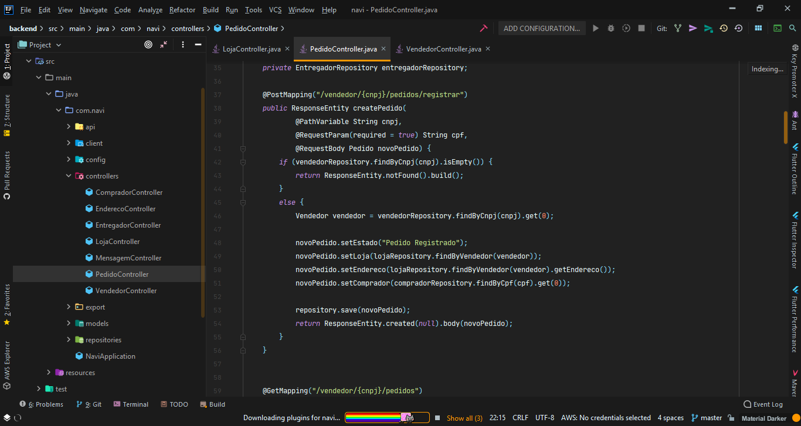
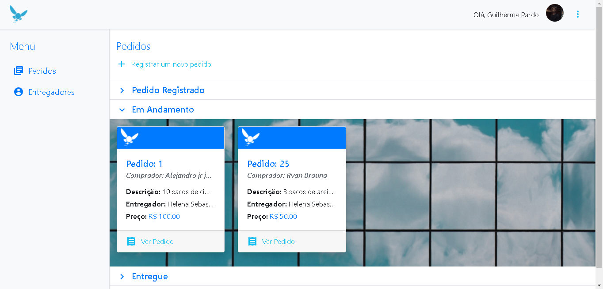

# navi

## Building materials delivery monitoring application. Where the owner of a building materials store can have greater management of their deliverers and their registered orders; And the customer of this building supply store can find out what orders he placed in that store and the delivery status.

### > Project status: **In development** :warning:

## The project was developed using the following languages, libraries and frameworks:

### > For the development of the _API Rest_ that we call Back-end, we used:
- Java
- Spring Boot
- JPA
- Hibernate
- JUnit
- Lombok
#### -> Implementing APIs / microservices like:

- **[Twilio](https://www.twilio.com)** (for the messaging part between the application and its users);

- **[ViaCEP](http://viacep.com.br)** (so that the fields related to the users' addresses are filled automatically, facilitating the registration);

### > For the development of our Front-end we use:
- JavaScript
- React
- Axios
- Bootstrap
- JQuery
- Materialize
#### -> Implementing APIs / microservices as:

- **[Google Maps](https://developers.google.com/maps/documentation?hl=pt-br)** (where we use it so that the buyer has a complete view of where his order is and so that the seller knows where his deliveries are)

